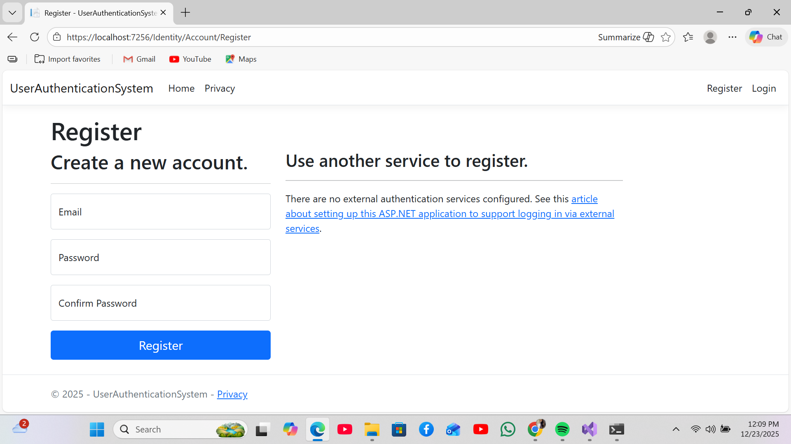
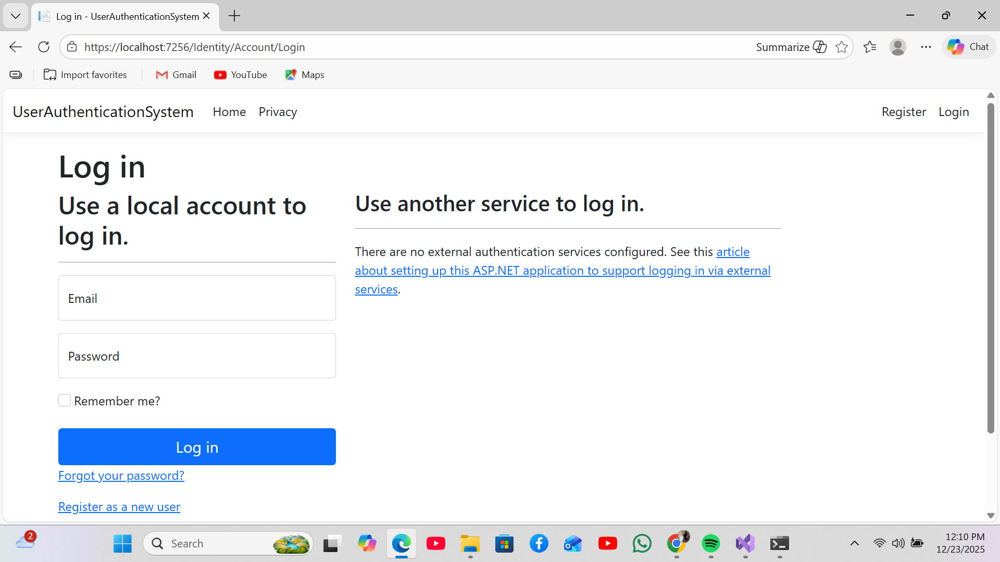
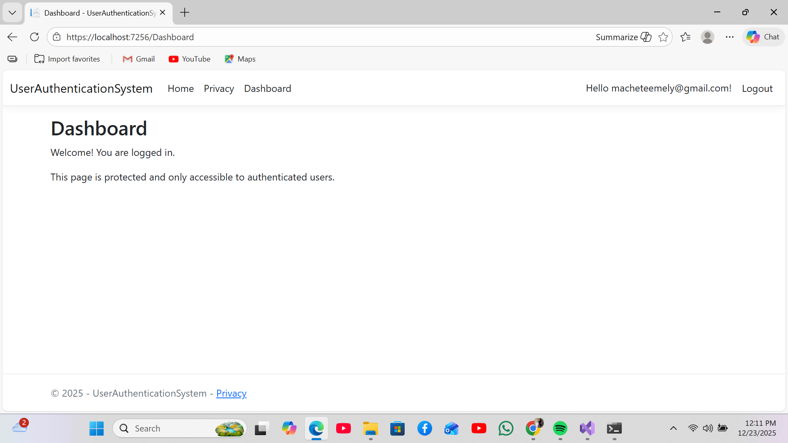
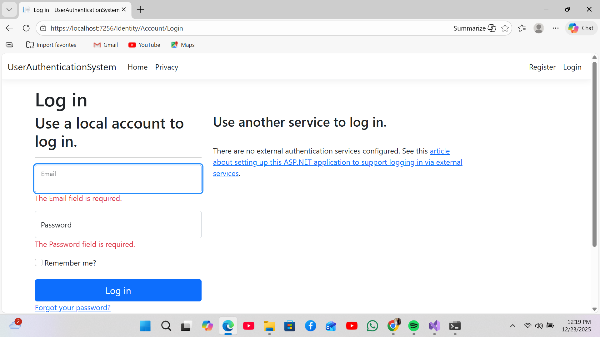

# User Authentication System

## Overview
The User Authentication System implements secure user registration, login, logout, and protected routes using ASP.NET Core Identity. The system is designed to handle authentication and access control using established, framework-provided security mechanisms rather than custom implementations.

This project focuses on correct handling of user identity, authentication state, and protected resources in a modern ASP.NET Core application.

## Problem Statement
Authentication is a core requirement for most real-world systems, and incorrect implementations can introduce serious security vulnerabilities such as weak password handling or unauthorized access.

This application addresses that risk by relying on ASP.NET Core Identity to manage credentials, authentication workflows, and protected routes in a standardized and secure manner.

## Core Features
- User registration with validated input
- Secure login and logout workflows
- Password hashing and credential storage managed by ASP.NET Core Identity
- Authentication-protected routes
- Database-backed identity persistence using Entity Framework Core

## Technology Stack
- Language: C#
- Framework: ASP.NET Core MVC
- Authentication: ASP.NET Core Identity
- ORM: Entity Framework Core
- Database: SQL Server
- Architecture: Model-View-Controller (MVC)

## System Design and Engineering Decisions
- ASP.NET Core Identity is used to avoid custom authentication logic and reduce security risk
- Authorization attributes are applied consistently to enforce protected routes
- Identity data is persisted using Entity Framework Core migrations to maintain schema integrity
- Security-sensitive operations are delegated to framework-tested components

## Assumptions and Limitations
- Single-tenant authentication model
- No role-based authorization or access policies
- No email verification or password recovery workflows
- No external identity providers

## What I Would Improve Next
- Role-based authorization and access policies
- Email verification and password reset workflows
- Account lockout and advanced security configuration
- External identity provider integration (OAuth)

## Outcome
This project demonstrates responsible implementation of authentication using ASP.NET Core Identity, with an emphasis on security, correctness, and maintainability.

## 📸 Screenshots

### Register

### Login

### Dashboard

### Login Validation

## Author
Emely Mokgadi Machete  
Junior Software Engineer (ASP.NET / C#)
